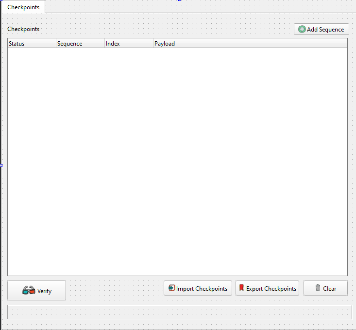

 

# Checkpoints Plugin

A lightweight DLT-Viewer plugin designed to verify the presence of predefined sequences within DLT logs. This tool offers easy options to update, export, and import sequences, making log analysis more efficient.

## Features

### Intuitive User Interface

The Checkpoints Plugin provides a clean and intuitive UI for seamless navigation and log sequence verification.

 

## Build and Installation Guide

Follow these steps to build and install the Checkpoints Plugin.

### 1. Install Dependencies

Begin by installing the required development tools and Qt libraries:

```bash
sudo apt install build-essential
sudo apt install qtcreator
sudo apt install qtbase5-dev qtchooser qt5-qmake qtbase5-dev-tools
sudo apt install libqt5serialport5-dev
```

### 2. Clone the Repository and Create a Build Directory

```bash
git clone https://github.com/mohannadmaklad/checkpoints.git
cd checkpoints
mkdir build && cd build
```

### 3. Build the Project

Use CMake to configure and build the plugin:

```bash
cmake ..
make -j$(nproc)
```

### 4. Locate the DLT-Viewer with Checkpoints Plugin

After a successful build, DLT-Viewer and the Checkpoints Plugin should be available in the following directory:

```bash
build/dlt-viewer-prefix/src/dlt-viewer-build/bin/dlt-viewer
```

## How the Build Process Works

The main `CMakeLists.txt` file automates the following steps:

1. **Downloads the DLT-Viewer Repository**  
   The CMake script retrieves the DLT-Viewer source files.

2. **Applies Necessary Patches**  
   Required patches are applied to integrate the Checkpoints Plugin seamlessly into DLT-Viewer’s build process.

3. **Adds Plugin Source Files**  
   The plugin's source files are copied to DLT-Viewer's plugin directory, ready for compilation.

4. **Builds and Installs DLT-Viewer with Plugin**  
   CMake compiles and installs both DLT-Viewer and the Checkpoints Plugin in a single, streamlined process.
